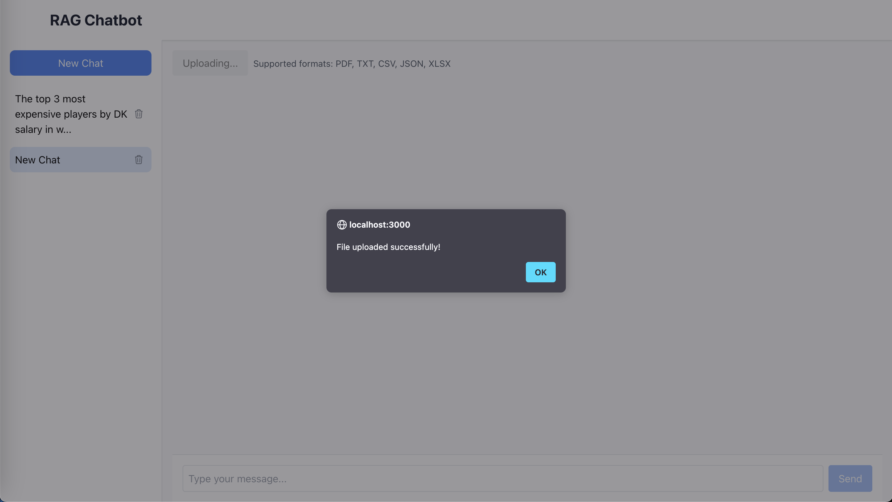
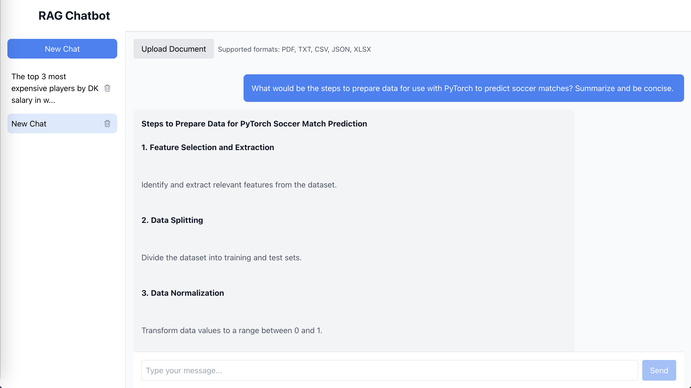
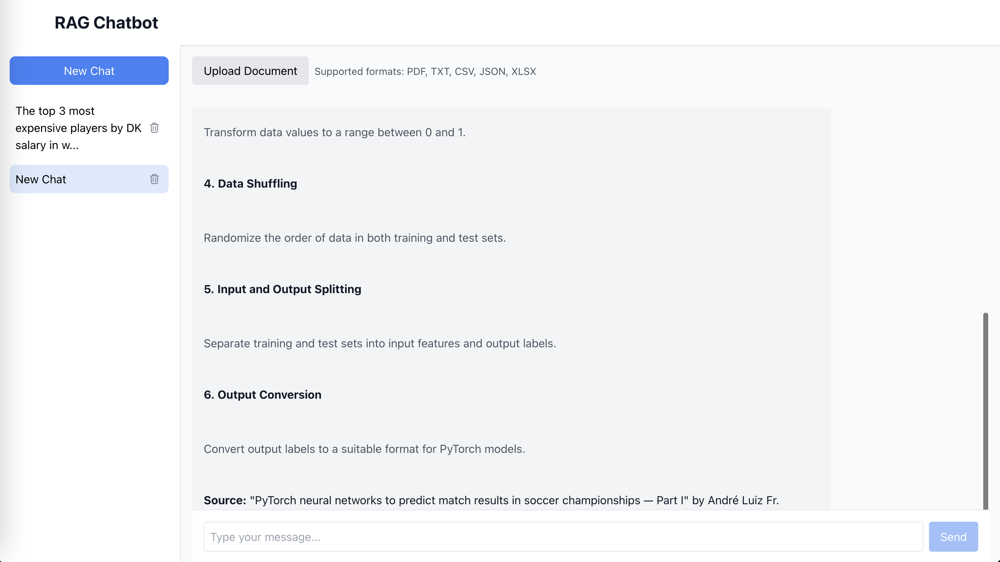
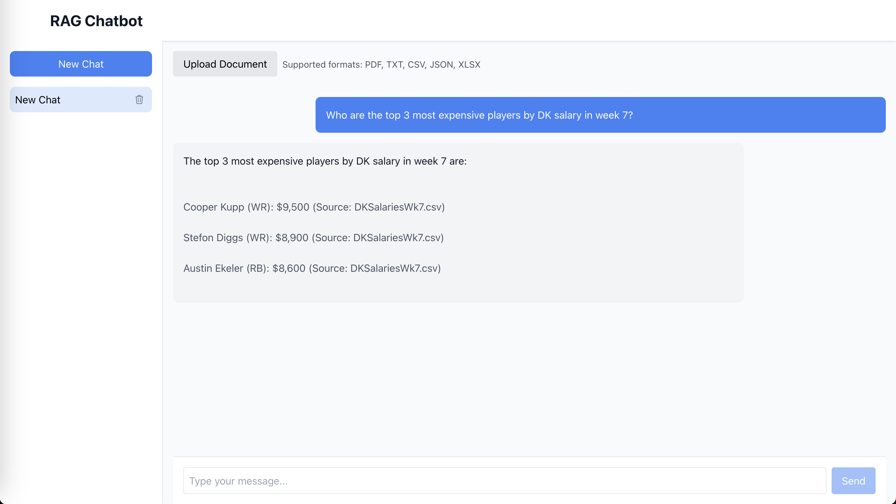
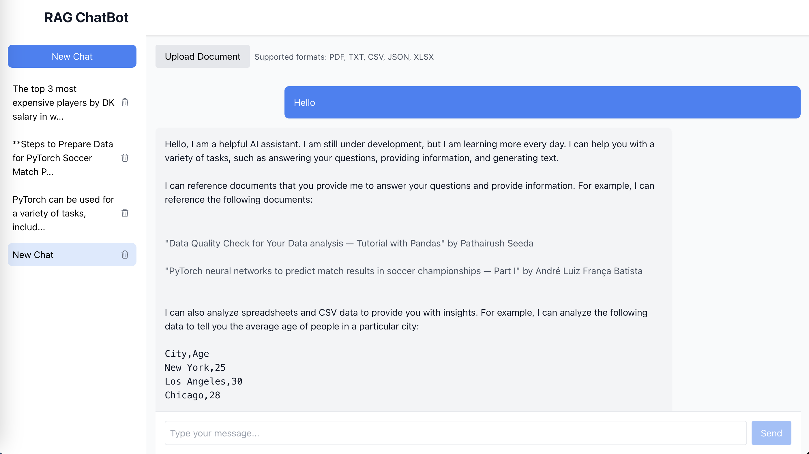

# RAG Chatbot Examples

This document showcases examples of using the RAG (Retrieval-Augmented Generation) ChatBot.

## Features

### Document Processing
- Supports multiple file formats (PDF, TXT, CSV, JSON, XLSX)
- Automatic text chunking and embedding generation
- Vector similarity search for relevant context

### Intelligent Responses
- Uses Google's Gemini Pro model
- Incorporates document context in responses
- Maintains conversation history
- Cites sources from uploaded documents

### User Experience
- Clean, intuitive interface
- Real-time response generation
- Document source tracking
- Conversation persistence

## Examples

### Document Upload

*Upload your documents (PDF, TXT, CSV, JSON, XLSX) to provide context for the chatbot.*

### Document-based Q&A

*Example of the chatbot answering questions using information from uploaded documents*

[Sample PDF Document](./docs/sample_files/sample_document.pdf) - Contains example pdf content used for Q&A

### Data Analysis

*The chatbot analyzing data from uploaded spreadsheets or CSV files.* 
[Sample CSV Data](./docs/sample_files/sample_data.csv) - Contains example tabular data used for analysis

### Chat Interface

*The chatbot provides responses based on the uploaded documents and maintains conversation context. All uploaded documents and its embeddings are stored in the database for future use. Bot will continue to have more and more context from additional documents uploaded and processed over time. Chat history is also stored in the database for future use and can be viewed by clicking on a chat.*